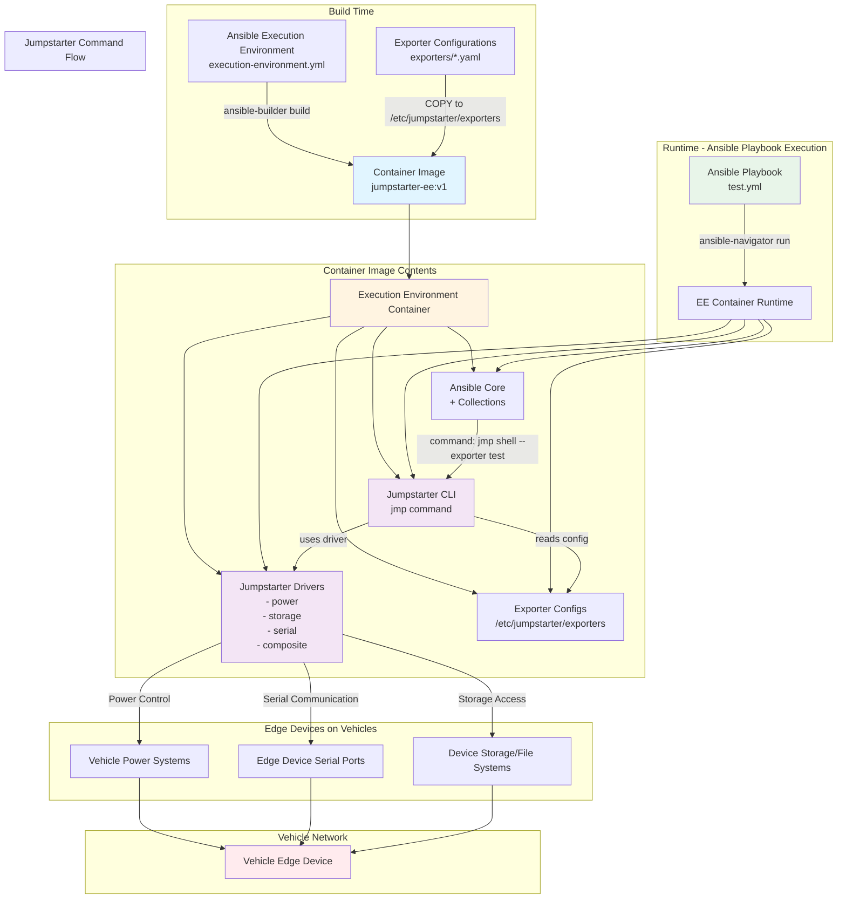

# Jumpstarter + Ansible Execution Environment Architecture

This diagram illustrates how Jumpstarter is integrated into an Ansible Execution Environment to manage edge devices on vehicles.



## Component Details

### 1. Execution Environment Build
- **Base Image**: Red Hat Ansible Automation Platform 25 (ee-minimal-rhel9)
- **Jumpstarter Installation**: CLI and drivers installed via pip from `pkg.jumpstarter.dev`
- **Exporter Configs**: Copied from `exporters/` directory to `/etc/jumpstarter/exporters` in container

### 2. Exporter Configuration
Each exporter YAML file defines:
- **Power Driver**: Controls device power (e.g., `MockPower`, real power controllers)
- **Storage Driver**: Manages device storage (e.g., `MockStorageMux`, OpenDAL backends)
- **Serial Driver**: Handles serial communication (e.g., `PySerial` with device URLs)

### 3. Ansible Playbook Execution
- Playbooks run inside the EE container
- Use `jmp` CLI commands via Ansible's `command` module
- Commands reference exporter configs by name (e.g., `--exporter test`)

### 4. Device Management Flow
1. Ansible playbook executes `jmp` command
2. Jumpstarter CLI reads exporter configuration
3. Appropriate driver interfaces with vehicle edge device
4. Power, serial, and storage operations are performed on the device

## Example Usage

```yaml
# test.yml
- hosts: localhost
  tasks:
    - name: Cycle power using Jumpstarter
      command: jmp shell --exporter test
      args:
        stdin: "j power cycle --wait 1\n"
```

This playbook:
1. Runs inside the EE container
2. Executes `jmp shell --exporter test`
3. Jumpstarter reads `/etc/jumpstarter/exporters/test.yaml`
4. Uses configured drivers to cycle power on the edge device

